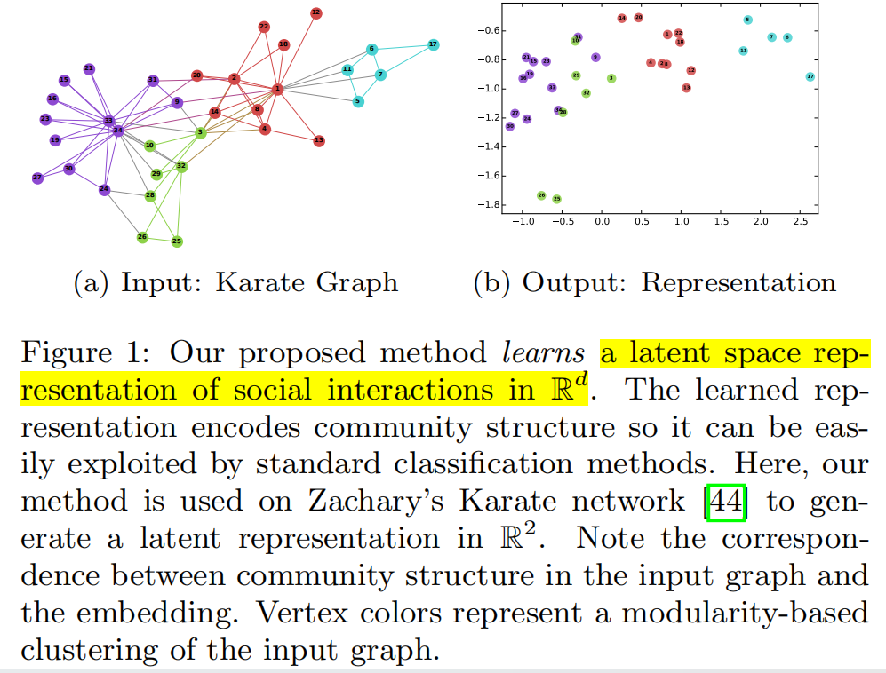
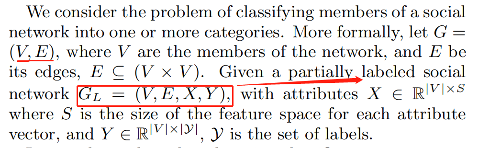

## DeepWalk: Online Learning of Social Representations

### 单词

Sparsity n. 稀少
social representations 

stochastic	随机的

generalization

analog

relaxation

### ABSTRACT

1) 作者提出了DeepWALK，一种新的学习网络嵌入表示向量的方法,能将图中节点转化为embeding的一种方法。
2) 将社会关系编码成潜在的表示，方便统计学模型利用
3) DeepWALK 是一个局部的截断随机游走，在Blog-Catalog, Flickr, 和 YouTube的几个多标签网络上表现出优越的性能
4) DeepWALK 与全局，特别是稀疏网络，与其他竞争放大相比F1分数更高，同时减少训练数据
5) 在线学习online learing 即来即去的


### INTRODUCTION


1.  稀疏网络表示有优点也有缺点，优点是能过够设计高效的**离散算法**(路径最优),但却缺乏了泛化性.(例如网络分类、内容推荐、异常检测和缺失链接预测等）
2.  作者引入一种在自然语言处理已经成功的算法用于到图谱中，其可以学习一个图向量的社会表示（social representation）DeeoWALK。社区表示是一组能够抓取邻居和社区关系的潜在特征的向量.(Social representations are latent features of the vertices that capture neighborhood similarity and community membership)
3.  DEEPWALK输入为图，输出为潜在表示向量。下面图中展示的是Karate Graph(跆拳道的图，应该是是人关系类似吧)输出为两维的向量。这个图说明，Deepwalk将graph的每一个系欸但编码成一个D维向量,依然保存了图中的社区，链接和结构信息，在图中相近的点，学习到的潜在表示也是相近的，而且出现了线性可分的边界。



作者指出相对于传统的G(V,E)图没有标签标注所以作者说尝试解决labeled网络的分类问题GL(V,E,X,Y).对于V,节点，E边，X对应V的属性，L是节点的分类label



反映链接信息的Embeding+反应节点本身的特征-->分类


作者也讲了几个概念

1 随机游走: 随机游走是一种从一个起始顶点开始，在图中进行随机步骤移动的过程。在这段文字中，一个以顶点 vi 为起始点的随机游走被表示为 Wvi。它是一个随机过程，包含随机变量 Wv1i、Wv2i、...、Wvki，其中 Wvki+1 是从顶点 vk 的邻居中随机选择的顶点。下面例子

```mathematica
现在我们以顶点 A 为起始点，进行一个随机游走。按照上面的描述，我们进行随机步骤移动。假设我们进行了三步，那么这个随机游走序列可以表示为 Wvi = [A, D, E]。在这个序列中，每个顶点是一个随机变量，例如 Wv1i 代表第一步移动后的顶点，即 A；Wv2i 代表第二步移动后的顶点，即 D；Wv3i 代表第三步移动后的顶点，即 E。
A -- B -- C
 \     |
  \    |
   D -- E
```

2 connection (链接|边):幂律分布

如果一个连通图的度分布遵循幂律分布（也就是无标度分布），那么我们会观察到在短随机游走中出现的顶点频率也会遵循幂律分布。简单来说，图中度数较高的顶点相对较少，而度数较低的顶点数量较多，这种分布特性在随机游走中的体现是：在短随机游走中，一些顶点会被经常访问，而另一些顶点则会较少被访问，呈现出类似于幂律分布的情况。这种现象启发了作者使用类似于自然语言建模的技术来捕捉这种社区结构中的信息

### METHOD 

方法部分

随机在G(图中)选择一个顶点 (wvi的根节点)vi, 
