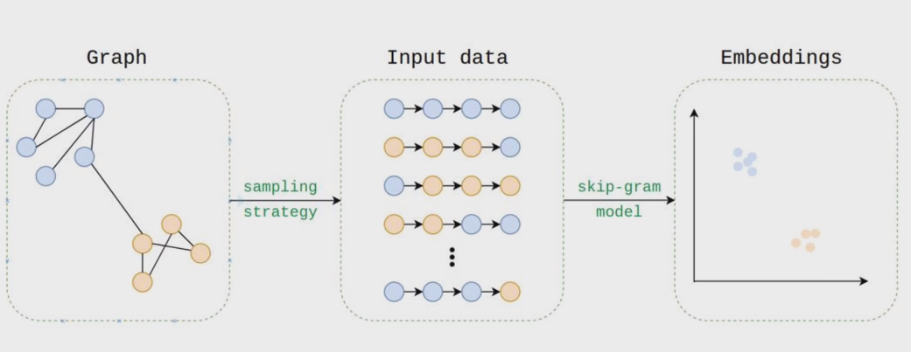
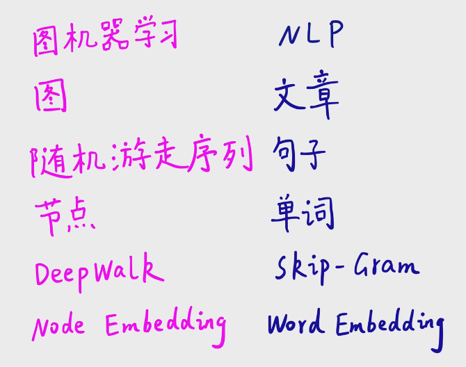
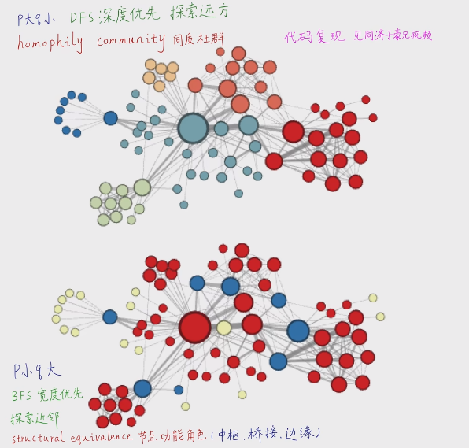
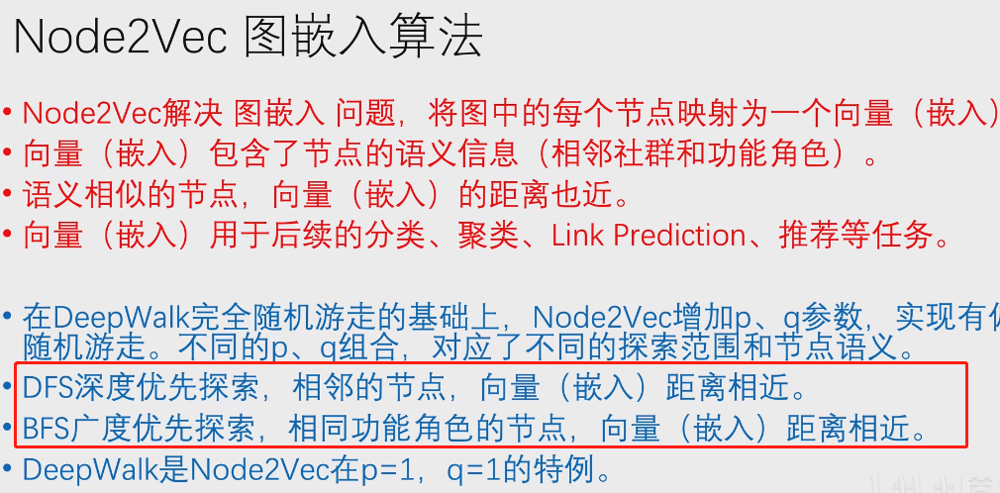
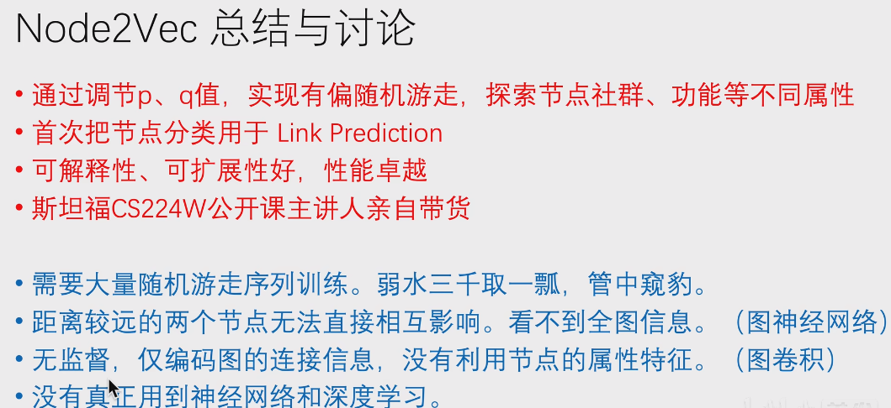
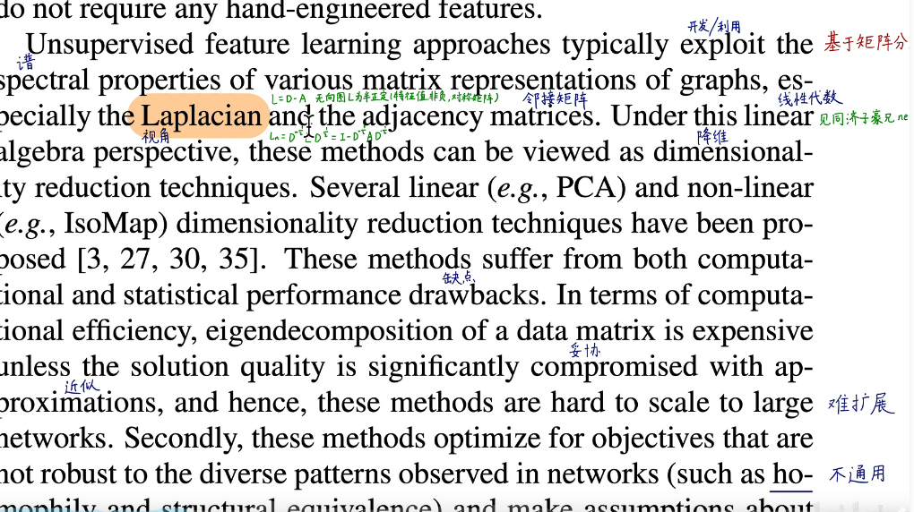
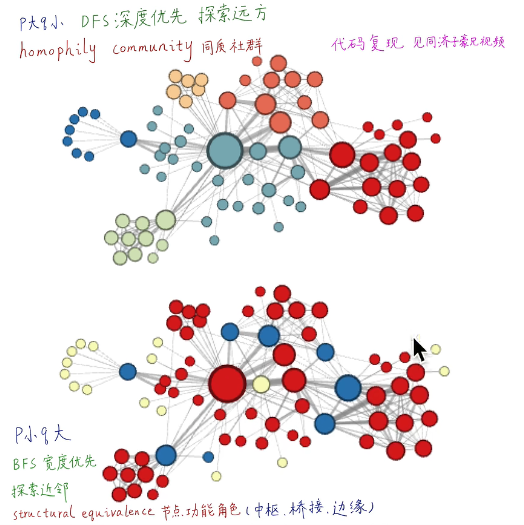

## 

将图中的节点投影成低维度稠密(纬度低，单个维度为连续的)的向量

图嵌入:

​	基于：

​		手工构造特征

​		矩阵分解

​		随机游走

​		图神经网络

随机游走: 

DEEPWALK: 原图中相近的点，在D维中依然接近

图机器学习和NLP处理的近似性

他们都是符合幂律分布的

DEEPWALK的缺点

Node2Vec

BFS广度优先（捕获社区特点)和DFS深度优先(捕获)

BFS（广度优先搜索）特点：

1. 广度优先搜索从起始节点开始，先遍历其所有直接相邻的节点，然后再遍历这些节点的相邻节点，以此类推，形成一层一层的遍历。
2. BFS 可以很好地捕捉到节点的局部结构，因为它优先探索离起始节点近的节点，从而更容易获取节点的近邻信息。
3. 由于广度优先搜索遍历的是近邻节点，所以在嵌入中可以保留节点的局部相似性，即相似的节点在嵌入空间中也更接近。

DFS（深度优先搜索）特点：

1. 深度优先搜索从起始节点开始，一直遍历到某个节点的最深层，然后回溯到上一层，再继续遍历其他分支。
2. DFS 有助于捕捉节点之间的全局结构，因为它会更深入地探索图的各个分支。
3. 在嵌入中，DFS 可以保留节点之间的远距离关系，从而更好地捕捉图的整体结构。

拉普拉斯矩阵 矩阵分解

特征值很难算，而且很难拓展，不能反应多样的特征

word2vec  相邻单词具有相似的语义，共现-->相似 反之不一定

