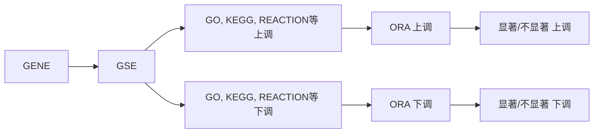
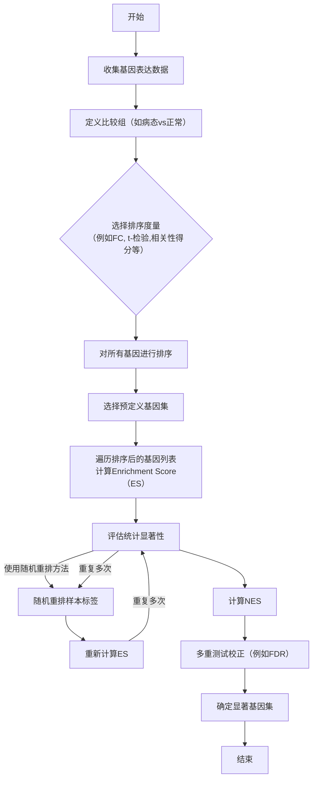
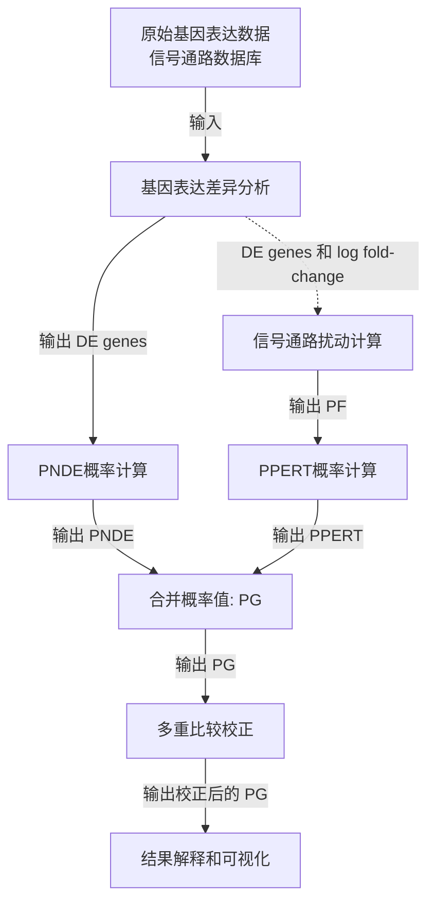

## 关于常用功能分析的应用和总结

因为最近在找一些多组学分析的方法，但是在多组学分析方法介绍部分总会提到的几个2010年以前的单组学方法，但是也是沿用至今的方法，所以我就很感兴趣，想整理分享一下，不过也是我们在转录组或者差异分析中常用的方法: Over-Representation Analysis (ORA),Gene Set Enrichment Analysis (GSEA),
Signaling Pathway Impact Analysis (SPIA2009).

### ORA 方法
ORA方法:本质上可以看成是在分组中，组与组之间的差异基因，对这些组与组之间差异比较大的基因进行功能注释后进一步分析的方法(KEGG,GO,NCI pathway,PMN等一些代谢库或者说本体论的注释数据库).

**目的:**
Over-Representation Analysis（ORA）的主要目的是识别那些在特定生物条件（例如疾病状态与正常状态）下显著改变的通路或功能组（如GO term）。
在分析过程中，我们通常会注意到某些特定的通路（或差异基因相关的GO term）在不同组别（例如，突变体和对照组）之间有着明显的基因差异表达。这种观察使这些通路或GO term成为我们进一步研究的重点。然而，问题是这些表现出显著差异的通路或GO term是否确实在整体背景下也是“过度表示”（Over-Represented）。换句话说，我们想通过Over-Representation Analysis（ORA）来验证这些通路或GO term是否真正具有统计显著性，以便确认它们是否在两个不同的生物学状态（如疾病和正常情况）之间有重要的差异。

**假设：** 

与某个生物过程或通路相关的基因在给定的基因列表中应该过度表示（Over-Represented）。

**计算原理：**

使用超几何分布（Hypergeometric Distribution）或者 Fisher's Exact Test 来计算富集的显著性。这些方法用于评估观察到的“过度表示”是否具有统计学意义。

**要求：**

- 已知的不同表达基因列表：这是进行ORA分析的基础，通常来源于一些高通量基因表达实验，如RNA-seq。
- 预定义的基因集：这些通常是基于生物学知识（如KEGG或GO数据库）预先定义好的一组基因，代表某一特定的生物过程或通路

**评估:**
    利用假设检验，然后利用阈值来判断事件是否发生是随机的.

##### 超几何分布 (Hypergeometric Distribution)

**假设：**

- \( N \)：背景集合的总基因数量
- \( K \)：背景集合中与某一特定通路或生物过程有关的基因数量
- \( n \)：给定的不同表达基因列表中的基因数量
- \( k \)：给定的不同表达基因列表中与某一特定通路或生物过程有关的基因数量

**超几何分布的概率质量函数（PMF）：**

\[
P(X=k) = \frac{{C(K, k) \times C(N-K, n-k)}}{{C(N, n)}}
\]

其中，\( C(a, b) \) 是组合数，表示从 \( a \) 个不同项中选取 \( b \) 个的不同方式数量。

##### Fisher's Exact Test (适合小样本，我查的资料n<40或者总值值为1)

因为超几何是直接得到是这个事件发生的概率，而Fisher 则是假设这个情况不是随机产生的属于极端事件，也就是说这个事件作为一个阈值，首然后，它会计算所有与这个观察到的情况同样极端或者更极端的可能性的概率之和。

**对于每个事件可以表示为一个2x2的列联表如下：**
\[
\begin{array}{ccc}
 & \text{在特定基因集中} & \text{不在特定基因集中} \\
\hline
\text{在差异表达基因列表中} & a & b \\
\text{不在差异表达基因列表中} & c & d \\
\end{array}
\]

**超几何分布 的 p 值可公式（上面那个格式拆开了而已：**

\[
p = \frac{{(a+b)!(c+d)!(a+c)!(b+d)!}}{{a!b!c!d!N!}}
\]

**Fisher's Exact Test的双侧P值通常计算为：**

\[
P(\text{更极端的表格出现|现在事件情况下}) = \sum_{\text{所有可能的2x2表格}} \frac{(a+b)! \times (c+d)! \times (a+c)! \times (b+d)!}{a! \times b! \times c! \times d! \times N!}
\]

----

### GSEA分析

GSEA是一种用于富集分析的计算方法，不同于单基因分析（如Over-Representation Analysis, ORA），GSEA分析的目标是找出一整个基因集或者通路是否在某种条件下整体上表达更活跃或更抑制。

文献地址 https://www.pnas.org/doi/10.1073/pnas.0506580102

#### 假设

1. **集体效应假设**: GSEA基于这样一个假设，即某一特定生物过程或通路的影响可能不是由单一基因导致的，而是一组基因共同作用的结果。

2. **连续表达假设**: GSEA不仅仅考虑差异显著表达的基因，它考虑整个基因表达谱。这是基于假设即使不显著的差异也可能在生物过程中有重要作用。

#### 计算原理

1. **基因排序**: 首先，根据它们在两个不同条件（通常是疾病状态和正常状态）下的t-test,相关性(与表型或者样本分组(0,1)),表达差异(FC)对所有基因进行排序。

2. **计算 Enrichment Score (ES)**: 遍历排序后的基因列表，累积一个富集得分（Enrichment Score, ES）。这个得分基于预定义基因集（对应某一特定生物过程或通路）在排序列表中的分布情况。最大ES表示该通路的最终分数

    - 当遇到预定义基因集中的一个基因时，得分会增加。
    - 当遇到不在预定义基因集中的一个基因时，得分会减少。

3. **评估统计显著性**: 实际得到的ES与通过多次随机模拟得到的ES进行比较，从而计算出一个p值。(通过多次随机模拟得到的零假设分布的均值和标准差。随机的分组这个要注意，不是随机选取基因)
   
   1. **随机重排（Permutation）**: 实验组和对照组的样本标签被随机重排，然后重新计算每个基因的表达差异和排序。
   
   2. **重新计算ES**: 使用这个随机重排后的数据重新进行基因排序和ES的计算。

   3. **重复以上步骤**: 通常，这个过程会重复数千次以生成一个比较稳定的零假设分布。
   4. **计算p值:** 观察到的ES与这个随机模拟生成的零假设分布进行比较，以计算p值。具体来说，p值是模拟生成的ES分布中，有多少比例的ES值大于或等于观察到的ES值（或绝对值上大于或等于观察到的绝对ES值，取决于是否考虑方向性）。
      数学上，如果有 \(N\) 次模拟，并且有 \(k\) 次模拟的ES值大于或等于观察到的ES值，则p值计算如下：

      \[
      p = \frac{k+1}{N+1}
      \]

      这里 \(+1\) 是为了避免0的出现，特别是当 \(k\) 为0时。

   
   5. **计算NES**: 最后，用观察到的ES与这个零假设分布的均值（\(\mu\)）和标准差（\(\sigma\)）来标准化，得到Normalized Enrichment Score (NES)。
    ​

    \[
    NES = \frac{ES - \mu}{\sigma}
    \]
    如果NES值非常高或非常低，并且对应的p值或FDR值小于预定的显著性水平（通常为0.05或更严格），则认为该基因集在所考察的生物学条件下具有显著的富集。

1. **多重测试校正**: 由于多个基因集会被测试，因此需要进行多重测试校正，常用的方法有FDR（False Discovery Rate）校正。

**数学公式：**

- \( \text{Phit}(S, i) = \sum_{g_j \in S, j \leq i} \left| r_j \right|^p / \text{NR} \)，其中 \( \text{NR} = \sum_{g_j \in S} \left| r_j \right|^p \)  
- \( \text{Pmiss}(S, i) = \sum_{g_j \notin S, j \leq i} 1 / (N - |S|) \)
- \( ES(S) \) 是 \( \text{Phit} - \text{Pmiss} \) 的最大偏离零的值。

这里 \( r_j \) 通常是与某个表型（phenotype）相关的排序度量（比如基于 t-检验的得分或者与表型相关的Pearson相关系数）。\( p \) 是一个参数，原文中默认为1(可以理解为调节增加变化程度的)。\( N \) 是总基因数，\( |S| \) 是预定义的基因集 \( S \) 的大小。

然后，我们计算 \( ES(S) \)，即 \( \text{Phit} - \text{Pmiss} \) 在遍历整个列表时从0开始并在列表的末尾返回0的最大偏离值。

通过这个方法，我们可以判断预定义的基因集 \( S \) 是否在整个基因列表的前端或后端（根据 \( r_j \) 排序）集中。如果 \( S \) 中的基因主要集中在列表的前端或后端，\( ES(S) \) 将会相应地较高，意味着 \( S \) 和表型有强烈的关联。

**关于GSEA的P值**
Normalized Enrichment Score (NES)
参考第三点==评估统计显著性==
\[
NES = \frac{ES - \mu}{\sigma}
\]
变量解释：
- \( ES \)：观察到的富集得分
- \( \mu \)：零假设分布的均值
- \( \sigma \)：零假设分布的标准差

----
### Signaling Pathway Impact Analysis (SPIA)
其实对于上面的ORA还是GSEA都是只考虑了单个Gene的权重(我这里的意思整个Pathway直接看成单个基因影响之和，所有基因产生的权重影响都是统一的函数映射 f(g)=w, Pathwayinfo = f({w1,w2,w3...})).但是在现实生物学意义过程中，f(g) 并不一定适应于所有同通路内所有Gene，可以理解为，有的基因在pathway或者注释的集合中更重要。比如

文献:https://www.ncbi.nlm.nih.gov/pmc/articles/PMC2732297/
SPIA was implemented as an R package available at http://vortex.cs.wayne.edu/ontoexpress/

SPIA 相较于ORA分析方式可以看下图也是文章中例子，a,b可能看成两个都是六个Gene的通路，每个通路存在两个差异基因(different Genes).但是在ORA分析方式下其实计算出来的P值相同的，但是这两种情况影响是不同因为他们存在差异表达的基因在pathway结构中是不一样的。正常的ORA分析超几何分布或者GSEA是不会考虑到内部GENE是否是通路中较大部分Gene的上游. A基因在上游，其差异表达影响的基因多，F基因处于边缘对整个通路影响没有那么大。所以作者就是希望开发一种方法能够考虑到pathway中基因的结构信息，这样就能更加精准的区分pathway影响程度.PPERT(作者的一个值)可以在这看成作者的开发的一种衡量pathway影响程度,值越小代表pathway影响越大

Capturing the topology of the pathways and the position of the gene
through the perturbation analysis. The figure shows a six-gene pathway with two DE genes (shown in gray) in two different situations. One of the two DE genes is in common (gene B) while the second gene is either a leafnode (a), or the entry point in the pathway (b). In (a), gene (F) cannot perturb the activity of other genes; in (b) gene (A) has the ability to influence the activity of all the remaining genes in the pathway, as the topology of the pathway indicates. An ORA would find the two situations equally (in)significant (PNDE =0.48 for a set of 20 monitored genes, out of which five are found to be DE). The perturbation evidence extracted by SPIA will give more significance to the situation in (b) (PPERT =0.24), even though fold-changes in (b) are almost twice as small as those in (a) (PPERT =0.57).

### 假设：
- 原假设（Null Hypothesis）：在研究的条件下，选定的通路没有受到显著的影响。
### 目的：
- 确定哪些生物分子通路在特定条件（例如，疾病状态与健康状态之间）下受到显著影响。
- 计算通路影响时考虑了通路的拓扑结构和基因表达的改变。

### 数学公式和参数：
##### \( PNDE \)：通路中差异表达（Differentially Expressed, DE）基因数的概率(就是超级几何，ORA分析计算通路的P值)。
#### \( PPERT \)：观察到通路扰动（Perturbation）的概率。
##### 计算基因扰动因子 (PF)

PF（Perturbation Factor）用于量化单个基因（\( gi \)）的扰动情况，并由以下方程给出：

\[
PF(g_i) = E(g_i) + \sum_{j=1}^{n} \frac{\beta_{ij} \cdot PF(g_j)}{N_{ds}(g_j)}
\]
- \( E(g_i) \)：基因 \( gi \) 的标准化的表达变化（通常是log-fold change）。
- \( \beta_{ij} \)：基因 \( gi \) 和 \( gj \) 之间相互作用的强度。
- \( N_{ds}(g_j) \)：基因 \( gj \) 的下游基因数量。

##### 计算累积扰动 (Acc)

累积扰动（Accumulated Perturbation）用于度量基因 \( gi \) 的总扰动，并由以下方程给出：

\[
Acc(g_i) = PF(g_i) - E(g_i)
\]

##### 矩阵方程求解累积扰动

累积扰动可以使用矩阵方程来求解：

\[
Acc = B \cdot (I - B)^{-1} \cdot E
\]

- \( B \)：标准化的加权有向邻接矩阵。
- \( I \)：单位矩阵。
- \( E \)：包含所有基因表达变化的矩阵。

##### 计算总累积扰动 (TA)

总累积扰动是所有基因累积扰动的总和：

\[
TA = \sum_i Acc(g_i)
\]

##### 计算PPERT

最后，PPERT是观察到比 \( TA \) 更极端的总累积扰动的概率，这可以通过Bootstrap方法来计算：

\[
PPERT = P(TA \geq tA | H_0)
\]

其中 \( H_0 \) 是原假设，即没有任何通路扰动。

- \( PG \)：全局概率值，用于排名受影响的通路。

###### 这里随机抽样计算步骤：

1. **初始化迭代计数器 \( k \)。**
2. **Bootstrap过程：**
    - 从实际数据中观察到的DE基因数量 \( N_{de}(Pi) \)，随机选取等数量的基因ID。
    - 为这些随机基因ID分配log fold-change，通常是从所有DE基因的分布中随机抽样。
    - 使用公式计算每个基因在 \( Pi \) 中的扰动累积（Acc）。
    - 计算总扰动累积 \( TA(k) = \sum_{i} Acc(g_{ik}) \)。
3. **重复步骤2和3 \( N_{ite} = 2000 \) 次。**
4. **中心化：**
    - 计算 \( TA \) 的中位数，并从 \( TA(k) \) 值中减去它，将分布中心化为0。
5. **判断：**
    - 如果调整后的 \( tA,c \) 是正的，通路被认为是激活（或正向扰动）的。
    - 如果是负的，则通路被认为是抑制（或负向扰动）的。

6. **合并PNDE和PPERT：**
    - 计算 \( PG \)，该值由 \( PNDE \) 和 \( PPERT \) 通过特定的数学表达式（例如超曲线下的面积）合成。
    关于文章具体计算在补充材料部分，但是其中没有说在bootstrap抽样赋值过程中，对于为被选为DE基因如何处理，如果按照假设那就是还是使用原来值，或者直接为0见上面那个图，里面只有差异基因有LogFC值

#### 全局概率值 PG 计算
将两种类型的证据——PNDE（通路中差异表达基因数的概率）和PPERT（通路扰动的概率）——结合成一个全局概率值 PG，用于排名受影响的通路并测试研究假设。

在计算该通路是否扰动时候，我补充下内容(和文中思想类似)
当考虑两个事件（或随机变量）\( PNDE \) 和 \( PPERT \) 在特定条件（比如X=没有差异）下的联合概率时，如果我们假设 \( PNDE \) 和 \( PPERT \) 是独立的，那么联合概率 \( P \) 可以表示为：
\[
P(PNDE = x, PPERT = y | X = \text{没有差异}) = P(PNDE = x | X = \text{没有差异}) \times P(PPERT = y | X = \text{没有差异})
\]
这里 \( x \) 和 \( y \) 分别是 \( PNDE \) 和 \( PPERT \) 的取值。

##### 基础数学模型

1. 首先，每个通路 \(i\) 都有两个与之关联的概率：\(PNDE(i)\) 和 \(PPERT(i)\)。
2. 这两个概率在零假设下应当是独立的，因此他们的联合概率 \(ci = PNDE(i) \times PPERT(i)\)。
3. 全局概率 \(PG\) 是观察到的 \(ci\) 值以下的概率。

##### 全局概率 PG 的计算

\[
PG = \int_{0}^{c} 1 \, dx + \int_{c}^{1} \frac{1}{x} \, dx = c - c \ln(c)
\]

这里，\(c = PNDE(i) \times PPERT(i)\)，而 \(PG\) 是观察到的 \(ci\) 值以下的概率。

##### 多重比较调整

文中还提到，因为多个通路同时被测试，所以还需要调整全局概率 \(PG(i)\) 以适应多重比较。这通常通过 Bonferroni 校正和 FDR（假阳性发现率）校正来实现。

##### 总结

1. \(PNDE(i)\) 和 \(PPERT(i)\) 是独立的，并在 [0, 1] 区间内均匀分布。
2. 联合概率 \(ci = PNDE(i) \times PPERT(i)\)。
3. \(PG\) 是观察到的 \(ci\) 值以下的概率，由 \(PG = c - c \ln(c)\) 计算。
4. \(PG\) 可用于排名受影响的通路，并且可能需要经过多重比较调整。

在 \( 1 \times 1 \) 平面上，\( PNDE \) 和 \( PPERT \) 的取值范围都在 \( 0 \) 到 \( 1 \) 之间。\( PNDE(i) \) 和 \( PPERT(i) \) 是两个独立的概率值，所以你可以考虑它们的乘积 \( c_i = PNDE(i) \times PPERT(i) \) 作为两者共同发生的联合概率。

现在，我们关心在这个 \( 1 \times 1 \) 平面上，\( c_i \) 以下（即比 \( c_i \) 更极端）的概率是多少。在数学上，这个可以通过计算超曲线 \( 1/(xy) = 1/z \) 或 \( xy = z \) 在 \( 1 \times 1 \) 平面上下和左侧区域的面积来完成。 这部分计算就对应了上面计算公式。

