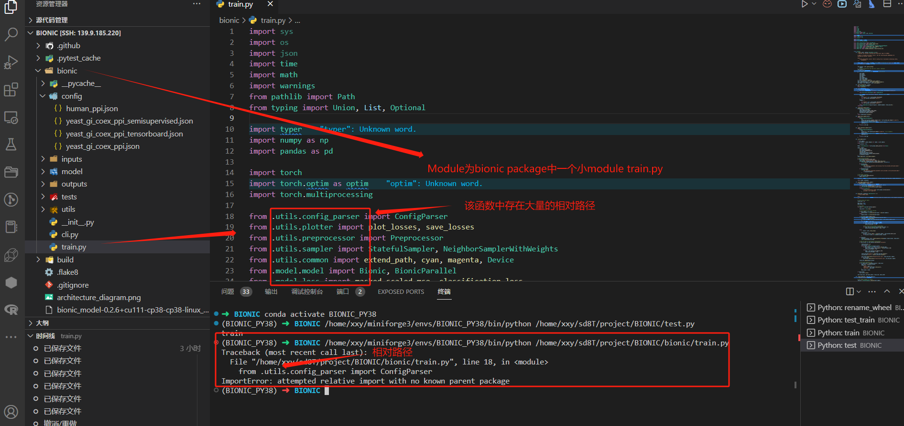

## ImportError: attempted relative import with no known parent packag

这是因为单独调用py文件时候，相对路径无法正确解析为绝对路径问题导致，也不是`__init__.py` 缺失问题.是因为我们调用的问题


报错信息为

```powershell
(BIONIC_PY38) ➜  BIONIC /home/xxy/miniforge3/envs/BIONIC_PY38/bin/python /home/xxy/sd8T/project/BIONIC/bionic/train.py 
Traceback (most recent call last):
  File "/home/xxy/sd8T/project/BIONIC/bionic/train.py", line 18, in <module>
    from .utils.config_parser import ConfigParser
ImportError: attempted relative import with no known parent package
```

报错时候文件结构



实际上我们使用的相对路径在真正使用直接调用 `train.py` 时候其 .utils.config_parser 在import 时候理论上会转化为 `/home/xxy/sd8T/project/BIONIC/bionic/train.py` 来引入。而由于单独执行`train.py` 导致其Python认为`train.py` 单独看成了一个main.py或者module 使得 无法正常获取绝对路径从而使得包的引用失败了


解决方法  

1 改为包导入，但是不推荐，我们看见这个config_parser导入成功了


2 上面那种不推荐因为改变了包的结构，我的建议是在 在包外部目录下创建一个test.py import train 模块,就可以执行train了 


当然最好的方法直接

`pytest bionic` 就可调用内部测试了

