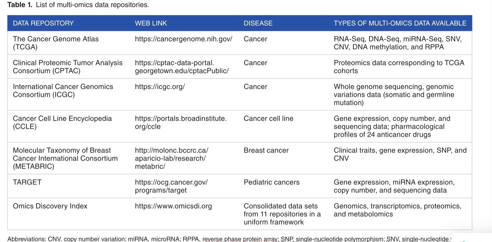
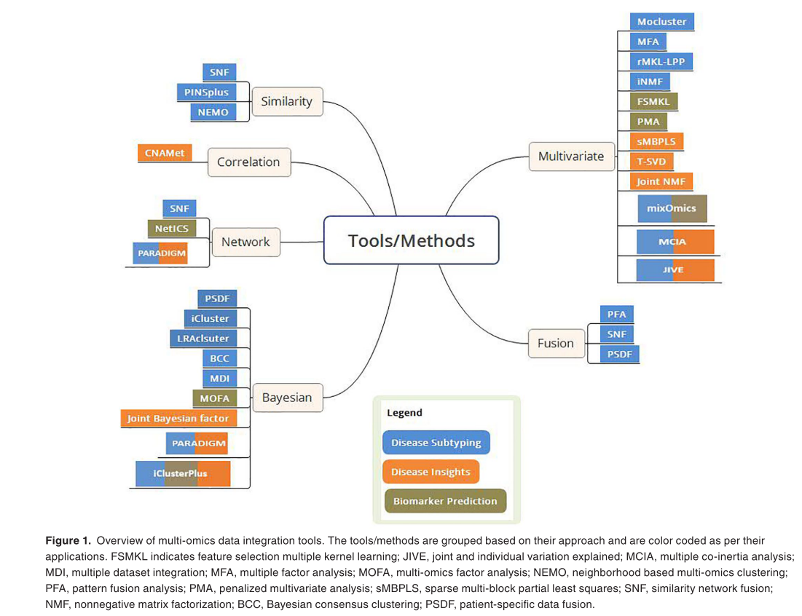

##  Multi-omics Data Integration, Interpretation, and Its Application

多组学整合，解释以及它的应用
### 摘要:
ABSTRACT: To study complex biological processes holistically, it is imperative to take an integrative approach that combines multi-omics data to highlight the interrelationships of the **involved biomolecules and their functions**. With the advent of high-throughput techniques and availability of multi-omics data generated from a large set of samples, several promising tools and methods have been developed for data integration and interpretation. In this review, we collected the tools and methods that adopt integrative approach to analyze multiple omics data and summarized their ability to address applications such as disease subtyping, biomarker prediction, and deriving insights into the data. We provide the methodology, use-cases, and limitations of these tools; brief account of multi-omics data repositories and visualization portals; and challenges associated with multi-omics data integration. KeywoRDS: multi-omics, data integration, disease subtyping, biomarker prediction, data repositories

    1 整合多组学方法可以帮助我们去理解生物分子和它们的功能之间的复杂关系
    2 随着高通量测序的发展,大量样本的多组学数据集产生，以及一些有用的工具被开发用于整合和及解析数据.
    3 在本综述中，作者收集了采用综合方法分析多个组学数据的工具和方法，并总结了它们解决疾病分型、生物标志物预测和获取数据见解等应用的能力。
    4 同时作者提供了这些工具的方法论,使用案例和局限性。简单的解释了多组学数据存储库和可视化网站，以及现有的多组学整合的挑战。

### 单词
holistically adv.holistic（整体的，全盘的）的副词形式；
imperative 势在必行的
interrelationships  相互关系
interpretation  解释
deriving v.得到( derive的现在分词 )；（从…中）得到获得；源于；（从…中）提取；
intricacy 复杂性
integrated 集成，综合
revolutionized  革新
front   n.前面；正面；身体前部；前线； adj.前面的；正面的；舌前的； v.面向；在…前面；用…作正面；领导；
taken the front seat in 在某些方面
sequential adj.按次序的，相继的，构成连续镜头的；时序；序贯；连续的
simultaneous    adj.同时发生的，同时存在的；同时的；联立的； n.同时译员；
interplay   n.相互作用；
assessing   v.评定( assess的现在分词 )；估价；对（财产、收入等）进行估价（作为征税根据）；确定（损害赔偿金、税款、罚款等）的金额；
flow    vi.流；垂；流出；（谈话、文体等）流畅； n.流动；滔滔不绝；涨潮；连贯； vt.使泛滥；淹没；排出；
bridging    n.剪刀撑； v.在…建桥( bridge的现在分词 )；
virtue  n.美德；德行；价值；长处；
phenomenon  n.现象，事件；奇迹；非凡的人；
prognostics 预测科学；
head and neck squamous cell carcinoma (HNSCC) 头颈部鳞状细胞癌
epidermal   表皮
epidermal growth factor receptor (EGFR) 表皮生长因子
prioritize  vt.按重要性排列，划分优先顺序；优先处理；
messenger   n.信使，信差；先驱；[军]通信兵，传令兵；
colon and rectal cancer 结肠癌和直肠癌
hepatocyte  n.肝（实质）细胞；
translocase 转位酶，移位酶；
outer   adj.外面的，外部的；远离内部（中心）的；[哲]客观外界的，物质的； n.环外命中；
mitochondrial   线粒体的；
oncogene    n.致癌基因；
proto-oncogene  原癌基因；
metabolomics    n.代谢物组学；
prostate cancer 前列腺癌
sphingosine n.（神经）鞘氨醇；
metabolite  n.代谢物；
hyperplasia n.增生，数量性肥大；
prostatic   前列腺的；
impaired    adj.受损的；出毛病的；有（身体或智力）缺陷的； v.损害，削弱( impair的过去式和过去分词 )；
criteria    n.（批评、判断等的）标准，准则( criterion的名词复数 )；(criterion的复数)；
lipidome    n. 脂质组
histological    adj.组织学的；
progression     n.（事件的）连续；一系列；发展，进展；<数>级数；
manifestation   n.表示，显示；示威；
mass spectrometry technique 质谱技术
pharmacological adj.药理学的；
anticancer  adj.抗癌的；
Actionable  adj.可控告的；
serous  adj.如水的；浆液（状）的；血浆的；含浆液的；
high-grade serous ovarian cancer   高级别浆液性卵巢癌
stratify    vt.<正，术>（使）分层，成层；
informed    adj.了解情况的；见多识广的；有情报根据的；消息灵通的； v.告诉( inform的过去式和过去分词)；(inform oneself)使了解；
Glioblastoma    成胶质细胞瘤，恶性胶质瘤，胶质母细胞瘤；
inactivity  n.不活动；不活跃；静止；不活泼；
retinoblastoma  n.眼癌（有遗传性）；
etiology     n.病因学，病源论；
intervention    n.介入，干涉，干预；调解，排解；
intrinsic   adj.固有的，内在的，本质的；[解剖]体内的；本征；先天性；
aberrant    adj.离开正路的；与正确（或真实情况）相背的；<生物>异常的；畸变的； n.离开正路的人；<生物>畸变生物（群）；畸变器官；反常； adv.反常地，异常地；
underlie    vt.位于或存在于（某物）之下；构成…的基础（或起因）；[经]构成优先于…的财政要求；
in the past decade  在过去的十年里
elusive adj.难以捉摸的；不易记住的；逃避的；难以找到的；
pilot   n.飞行员；引航员；向导；[机械学]导向器（或轴）； vt.驾驶；试验；试点；为（船舶）引航（或操舵）； adj.试验性的；导向的；驾驶员的；辅助的
hypergeometric  n.超几何分布；超比;
mammalian   n.哺乳动物； adj.哺乳动物的；
Overrepresentation
efficacy    n.功效；效力；效验；生产率；
borderline  n.分界线，国界线； adj.边界上的；边界附近的；暧昧的；不明确的；
scattered   adj.分散的；零散的；疏落的；到处都是…的；
interpret   vt.解释；理解；诠释，体现；口译； vi.作解释；作口译；
link out to 链接到
lung    n.肺；呼吸器官；[医]辅助呼吸的装置；〈英〉可供呼吸新鲜空气的地方；
adenocarcinoma  n.腺癌；
outperform  vt.做得比…更好，胜过； v.（机器等）性能比…好；
shown to outperform 表现优于
adapted adj.适合的； v.（使）适应， （使）适合( adapt的过去式和过去分词 )；改编，改写；改变…以适合(for)；适应于，适应不同情况（或环境）(to)；
abrogate    vt.废除（法律等）；取消；去掉；抛开； n.取消，废除；
moderate    adj.有节制的；稳健的，温和的；适度的，中等的；<美俚>慢吞吞的； vt.使和缓；主持；节制； vi.变缓和；作主持人；

----
## 介绍

人类疾病与健康的全面理解需要多个水平数据提供可解释性。测序书记的发展，生命科学越来越依赖于不同水平的数据用于研究。可以的多组学数据通过集成多个水平的方法为现有的医疗和生物领域带来了新的变革。

与临床信息结合的多组学分析已经在分子功能上获得了有用的见解.整合多组学数据可以提供不同层的分子的信息可以有助于理解复杂的生物学功能。整合一个个体的多组学的连续或者同时的数据集，可以帮我我们理解分子间相互作用。

----
有一些公开可用的数据库，如表1所示，提供了患者的多组数据集。

提供根据所使用的方法分组的综合工具和方法的示意图表示。

