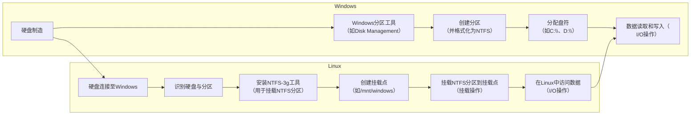

## Ubuntu 硬盘分区挂载

**这里只接挂载一整个硬盘没有去作分区，因为本身是一个有数据硬盘，如果要想分区则可以去检索挂载后分区的资料,如果你没分区，则也可以直接挂载整个硬盘**


相关命令

1 查看我们自己有的硬盘,然后确定自己想挂载的硬盘分区 `lsblk -l` 其输出结果有部分如下图部分可以看到/dev 后面就是不同硬盘分区信息了

- `/dev`是设备文件的存储目录。
- `sd`表示SCSI（Small Computer System Interface）设备，但也适用于许多其他类型的磁盘设备。<span style="color:red;"> 也就是比如nvme就是名字有差别的可以看下面</span>
- `X`是字母，代表硬盘的标识符，例如，`a`、`b`、`c`等，用于区分不同的物理硬盘。
- `n`是数字，代表硬盘上的分区号，例如，`1`、`2`、`3`等。

​	

```shell
sudo lsblk -l
```


1 在我们想要挂载的文件夹创建一文件夹

```shell
mkdir sd8T
sudo mount /dev/sda1 sd8T # 将目标硬盘挂载到该目录下 
```


### 	开机挂载尝试

```
blkid /dev/sda1 # 查看想要挂载分区的UUID
```


```
vim /etc/fstab

# 进入编辑模式:i 保存退出:Esc :wq 回车
# [分区UUID] [挂载目录] [分区格式] [默认配置] [开机不检查硬盘] [交换分区]
UUID=1234-1234-1234 /data ext4 defaults 0 0
```

### 取消挂载

```
umount /data
```


### 遇到的报错信息


1. **文件系统类型不正确：** 这个错误通常表示你尝试挂载的分区的文件系统类型与指定的文件系统类型不匹配。确保你知道硬盘的文件系统类型，然后使用正确的文件系统类型进行挂载。例如，如果文件系统是ext4，可以使用以下命令：
   
   ```bash
   sudo mount -t ext4 /dev/sda /mnt/sd8T # 这里我的是ntfs那我命令就是 mount -t ntfs /dev/sda
   ```

2. **选项错误：** 挂载命令中的选项可能不正确。确保选项中没有错误。默认情况下，通常可以使用`defaults`选项。

3. **损坏的超级块：** 文件系统可能已损坏。你可以尝试使用`fsck`命令来修复文件系统。首先，卸载分区：

   ```bash
   sudo umount /mnt/sd8T
   ```

   然后运行`fsck`命令：

   ```bash
   sudo fsck -f /dev/sda
   ```

   这将尝试修复文件系统中的错误。

4. **缺少编码页面或辅助程序：** 这可能需要安装相关的软件包，具体取决于文件系统类型。例如，如果你正在挂载NTFS分区，你可能需要安装`nfs-common`软件包：

   ```bash
   sudo apt-get install nfs-common  # nfts
   sudo apt install cifs-utils	# CIFS
   ```


### 挂载成功

```shell
sudo mount -t ext4 /dev/sda /mnt/sd8T 
```

结果如下利用`df -hT`  可以发现已经挂载到了/home/xxysd8T 目录下


文件系统类型的查看  `lsblk -f`


### 补充

#### 1文件系统有哪些呢，分别由什么特点呢，为什么不能直接挂载中间是有逻辑转换吗

1. **ext4（Fourth Extended Filesystem）：**
   - 特点：ext4是Linux系统中最常用的文件系统之一。它支持大容量分区、大文件大小，具有高性能和稳定性。它还提供了日志功能，以减少数据损失的风险。
2. **NTFS（New Technology File System）：**
   - 特点：NTFS是Windows操作系统主要使用的文件系统。它支持大容量存储、文件权限、加密、压缩和稳定性。在Linux上可以通过ntfs-3g驱动来访问NTFS分区。
3. **FAT（File Allocation Table）：**
   - 特点：FAT文件系统是一种简单的文件系统，通常用于移动设备和闪存驱动器。它不支持文件权限，但具有广泛的兼容性。
4. **exFAT（Extended File Allocation Table）：**
   - 特点：exFAT是FAT文件系统的扩展版本，支持更大的文件和分区。它通常用于外部存储设备，如闪存驱动器和SD卡。
5. **ZFS（Zettabyte File System）：**
   - 特点：ZFS是一个高级文件系统，具有数据完整性检查、压缩、快照和各种存储管理功能。它通常用于高性能计算和大型存储系统。
6. **Btrfs（B-tree File System）：**
   - 特点：Btrfs是Linux上的一种先进的文件系统，支持数据快照、压缩、校验和、自动修复等高级功能。
7. **HFS+（Hierarchical File System Plus）：**
   - 特点：HFS+是苹果公司在Mac OS X上使用的文件系统，支持元数据和日志功能，适用于苹果硬件。


关于为什么不能直接挂载中间有逻辑转换，这涉及到文件系统的结构和操作原理。文件系统是一种用于组织和管理数据的数据结构，它包含有关文件和目录的信息，以及存储文件内容的方式。文件系统通常有自己的数据结构、元数据、索引等，以便有效地访问和维护文件。

当你挂载一个硬盘分区时，操作系统需要理解并与文件系统交互，以便正确地读取和写入文件。这就需要操作系统了解文件系统的结构和如何解释文件和目录的层次结构。因此，挂载是必要的，因为它建立了操作系统和文件系统之间的桥梁，使它们可以协同工作。

文件系统也可能包含复杂的特性，如文件权限、访问控制列表（ACL）、加密、压缩、快照等。这些功能需要文件系统驱动程序来实现，而不是直接由操作系统处理。挂载是连接文件系统和文件系统驱动程序的过程，以便操作系统可以正确地管理和访问文件系统中的数据。

因此，挂载是文件系统操作的关键步骤，它确保操作系统能够与文件系统进行交互，以便读取和写入数据。如果没有挂载过程，操作系统将无法理解文件系统的结构和特性，从而无法正确地访问文件和数据。

#### 那一个硬盘文件系统是怎么存在的呢

1. **硬盘制造和分区：** 首先，硬盘制造商会制造硬盘，并将其分为一个或多个分区。硬盘分区是硬盘的逻辑部分，每个分区可以包含一个文件系统。这些分区可以根据制造商的预设或用户的需求进行创建。
2. **文件系统格式化：** 在硬盘上创建分区后，用户或操作系统需要对每个分区进行文件系统格式化。格式化是一个过程，它在分区上创建文件系统的数据结构和元数据，以便操作系统能够管理和存储文件。格式化通常由用户或操作系统安装程序执行，根据所需的文件系统类型进行选择，如ext4、NTFS、FAT32等。
3. **文件系统管理：** 一旦文件系统格式化完成，操作系统就可以开始使用它来管理硬盘上的文件和数据。用户可以创建、读取、写入和删除文件，而文件系统负责在硬盘上跟踪文件和数据的位置、大小和权限等信息。
4. **挂载：** 当用户或操作系统需要访问硬盘上的文件时，必须将文件系统挂载到文件系统层次结构中的某个目录。挂载是一个操作，它建立了硬盘文件系统和操作系统之间的连接，使操作系统能够通过目录路径来访问硬盘上的文件和数据。

### 硬盘挂载逻辑图





<script type="module">
  import mermaid from 'https://cdn.jsdelivr.net/npm/mermaid@10/dist/mermaid.esm.min.mjs';
  mermaid.initialize({ startOnLoad: true });
</script>


```html
<div class="mermaid">
    graph LR;
    subgraph Windows
      A[硬盘制造] --> B[Windows分区工具 <br/>（如Disk Management）];
      B --> C[创建分区<br/>（并格式化为NTFS）];
      C --> D[分配盘符<br/>（如C:\\、D:\\）];
      D --> E[存储数据至NTFS分区<br/>I/O操作];
    end

    subgraph Linux
      F[Linux操作系统<br/>（如Ubuntu）];
      F --> G[识别硬盘与分区];
      G --> H[安装NTFS-3g工具<br/>（用于挂载NTFS分区）];
      H --> I[创建挂载点<br/>（如/mnt/windows）];
      I --> J[挂载NTFS分区到挂载点<br/>（挂载操作）];
      J --> K[在Linux中访问数据<br/>（I/O操作）];
    end
    A --> F[硬盘连接至Windows];
    K --> E[数据读取和写入（<br/>I/O操作）];
  </div>
