| layout | title                                                        | categories | description                                                  | keywords                |
| ------ | ------------------------------------------------------------ | ---------- | ------------------------------------------------------------ | ----------------------- |
| post   | AFTGAN: prediction of multi-type PPI based on attention free transformer and graph attention network | 图方法     | AFTGAN 一个新的神经网络模型构建用于预测多种类型的PPI。在特征输入方面，除了氨基酸共现相似度和一热编码外，还加入了含有大量蛋白质生物信息的ESM-1b嵌入作为蛋白质序列特征。 | AFTGAN, 图,生物信息方法 |

# AFTGAN: prediction of multi-type PPI based on attention free transformer and graph attention network

  ## 摘要

蛋白质和蛋白质相互租用网路和转录调控网络对于细胞之间的调节和信号处理是至关重要的。一个PPI的彻底理解对于正常和疾病状态下的细胞生理学具体有重大意义。

最然已经有很多方法用于预测蛋白质相互作用但是，对于预测未知蛋白质之间的相互作用仍然具有非常大的挑战。

AFTGAN 一个新的神经网络模型构建用于预测多种类型的PPI。在特征输入方面，除了氨基酸共现相似度和一热编码外，还加入了含有大量蛋白质生物信息的ESM-1b嵌入作为蛋白质序列特征。

集成网络 AFT 和 图注意力网络:

​	AFT模块(对重要的蛋白质序列特征信息进行权重运算)

​	graph attention network (extracting the relational features of protein pairs) for the part of the network framework.

实验结果表明，基于三种分区方案(BFS、DFS和随机模式)的AFTGAN在SHS27K和SHS148K数据集上的Micro-F1分别为0.685、0.711和0.867,0.745、0.819和0.920，均高于其他常用方法。此外，通过实验比较，验证了所提模型在STRING数据集上预测未知蛋白PPIs的性能优势。

单词

thorough	adj.彻底的，全面的，充分的，彻头彻尾的，根本的，详尽的，严密的；十足的，考虑周到的；非常精确的，（对细节）不厌其烦的；绝对的，完善的； prep.〈古〉同“through”； n.[英史]专横政策；
fed n.(F-)<美，非正>（美国）联邦政府执法官员，（尤指）联邦调查局调查员；feed的过去式和过去分词； v.喂养( feed的过去式和过去分词 )；满足（欲望等）；向…提供；供…作食物；
physiology	n.生理学；生理机能；
ensemble	n.全体；<音>合奏；全套服装；总效果；集成An ensemble network 一种集成网络
expressiveness	n.表现，表示；
fine-tuned 微调
tertiary	adj.第三的；<医>第三期的；(T-)<地>第三纪的；<化>叔的； n.(T-)<地>第三纪；第三系；三期梅毒病害；<宗>第三级教士；
executionn.实行，履行，执行，贯彻；作成，完成，签名盖印使法律文件生效，执行法律；执行死刑，强制执行，执行命令；成功，奏效，效果；
catalysis	n.催化作用；
Selenocysteine	硒半胱氨酸 
Pyrrolysine	n.吡咯赖氨酸；

proposed	adj.被提议的，所推荐的； v.提议，建议( propose的过去式和过去分词 )；打算；提供（解释）；提出（行动，计划或供表决的方案等）；

decimal	adj.十进位的，小数的； n.小数；

padding

stride

willingness

basis	n.基础；主要成分；基准，基本原则；

semantic	adj.<语>语义的，语义学的；

ramp up	

## 内容

单个蛋白质的任务是通过蛋白质与蛋白质之间相互作用，而不是通过单独一个蛋白质去实现对应功能

实验方法去确定蛋白质相互作用：

​	贵,费时间,单个实验无法完全的做出判断----一种通过计算准确预测未知的蛋白质相互作用的方法的必要性

由于氨基酸序列已被证实包含了所有蛋白质的信息，且易于获得(Anfinsen, 1972)，基于序列的方法早已被应用于蛋白质相关任务的建模(PPI 和 蛋白质分类)

早期方法基于ML:

	* auto covariance (AC),SVM-->Saccharomyces cerevisiae.酿酒酵母PPI数据预测的特征提取。
	* the logistic regression to predict the PPI type
	* rotation forest algorithm 基于蛋白质理化性质和序列去预测PPI
	上述方法都提供了可行的解决方案，但由于无法有效提取PPI特征和预测模型表达能力有限，其性能受到限制。
DL方法:
	* 2018年的DNN-PPI直接基于序列学习特征去预测PPI，用两个相互作用蛋白序列进行编码，嵌入和卷积和LSTM网络。然后将两个输出的连接向量串联起来作为全连接神经网络的输入进行学习
	* Chen等人(2019)引入了一种通过蛋白质序列预测PPI的端到端框架(PIPR)。该方法通过在Siamese体系结构中加入深度残差循环卷积神经网络，利用强烈的局部特征和上下文信息，有利于提取蛋白质序列的相互作用特征。

	* Transformer的应用---蛋白质分类和蛋白质.基于无监督的方法训练到蛋白质序列的表示特征。学习后的表示空间呈现出从氨基酸生化性质到蛋白质远端同源性的多尺度结构
	
	* 基于PPI去提取蛋白质相互作用的信息 ，  GNN-PPI 所有的智人PPIs作为我们的测试数据集(tSTRING)。该模型包含15 335个蛋白质和593 397个PPIs，应用该模型对未知蛋白质进行了预测。

​	  

### 原材料和方法

**训练数据准备: **STRING数据库(Homo sapiens, Taxon ID: 9606) 随机抽取了1690和5189个蛋白质的集合。两个数据集的序列一致性小于40%.SHS27K和SHS148K相互作用数目为7624和44488.在SHS27K中生成序列一致性<20%的新子数据集，用于PPI预测检验和比较。对于构建子集的方法作者进行了比较breadth-first search (BFS), depth-first search(DFS) and random schemes 

**特征提取:** 

对于每一个氨基酸用一个特征向量表示E(A)=[E1(A),E2(A),E3(A)]

E1(a)是一个五维的向量基于Skip-Gram model 预测拿到的得到

E2(a)是一个one-hot向量 基于氨基酸本身静电和疏水的定义的分类，对于特殊氨基酸(.Selenocysteine, Pyrrolysine and unknown amino acids)定义为类型8

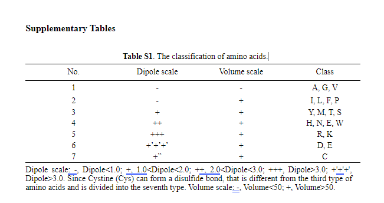

E3(a) 基于Transformer预训练得蛋白质编码模型(ESM-1b) 数据--Uniparc 数据库。得到的预训练模型将原始序列映射到没有标签或先验知识的生物特征表示。ESM-1b((已经发表的论文)将相应的蛋白质编码为l1280的特征，其中L表示蛋白质长度。因此，每个氨基酸被表示为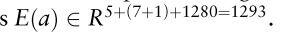

**AFTGAN模型得简介**

该模型由三部分组成:
	1 Protein sequence 特征提取(1D convolution and transformer encoder)
	2 利用图注意力网络提取蛋白质对之间得关系特征
	3 通过全连接层和三层图啊注意层对提取的特征进行多标签PPI预测

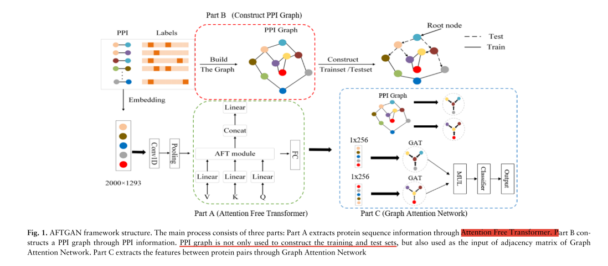

**蛋白质序列特征的提取**
	蛋白质序列长度为2000个，未满足的蛋白质序列进行截断。每个氨基酸的特征为1293个(E1(a),E2(a),E(3))    2000*1293

​	input过1d卷积核3*3，padding 0 --> 1* 1998个特征图 --> 最大池化层（stride=3） 1x 666个特征图 -->Transformer encoder(AFT)-->1X666再走一个全链接层 1x256

To be specific, Q, V and K are vectors obtained through the linear layer linear 666; 666

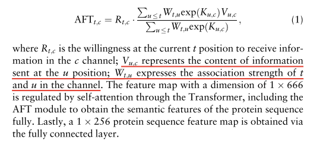

**蛋白质对之间的关系特征的提取，注意力图神经网路**

基于图注意机制的方法计算节点之间的特征，图的创建基于STRING的PPI 相互作用分类为7个图

其中b{}表示所节点向量的集合，b下标表示节点单独一个向量

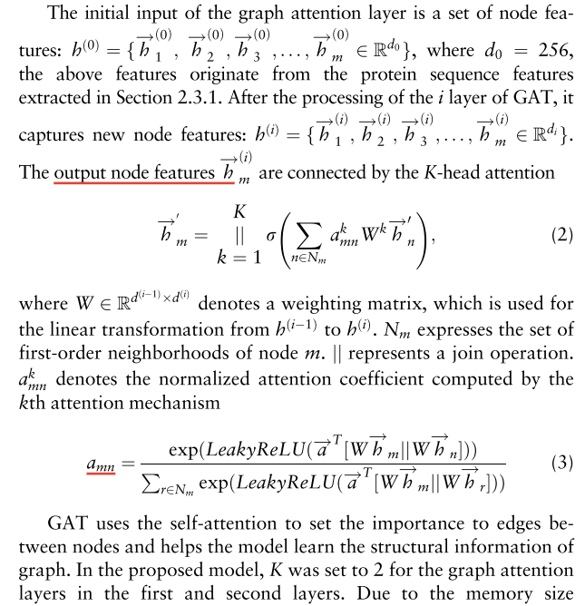

**多标签的PPI预测**

对于蛋白质和蛋白质二输出的向量结果进行点积，然后利用全连接进行分类。 标签和标签的值计算交叉熵优化方法---从结果来看是output了7个值

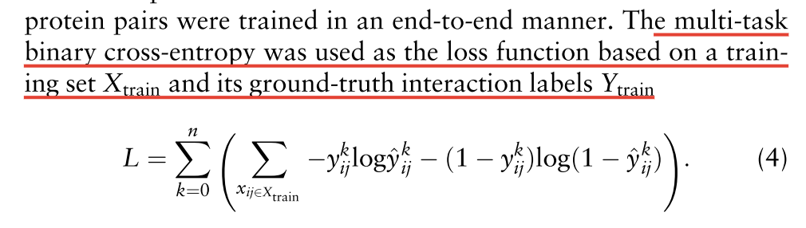

**4 AFTGAN model setting**

AFTGAN模型主要包括蛋白质序列特征提取模块，该模块由Transformer的一维卷积和编码器组成，包括AFT模块;蛋白质对关系特征提取模块，其图注意网络由三层图注意层堆叠而成。蛋白质序列特征提取模块包括设置为3的1D卷积和设置为0的填充的卷积核。归一化方法为batch norm.。池的方法是Max pooling，池的大小设置为3。AFT模块的d_mode为666,n为1。GAT使用的激活函数是蛋白质对关联特征提取模块中的RELU 。预测模型中的优化算法为Adam (Kingma and Ba, 2014)，初始学习率为0.001,weight_decay设为5e-4。使用ReduceLROnPlateau改变学习速率，模式设置为min，因子参数设置为0.5，patience设置为20。drop - out设置为0.5，batch size为1024，共运行2000个epochs。

**实验结果和讨论**

​		*实验数据和评估指标*

​		实验数据来源于三个随机策略BFS,DFS，random 去将数据集划分为训练积和测试积，我为了保证训练效果作者限制了其root节点node <t=5,s三次实验去计算指标平均值代表策略的水平。

​		评估指标 

 		Hamming Loss, Precision, Recall and Micro-F1	

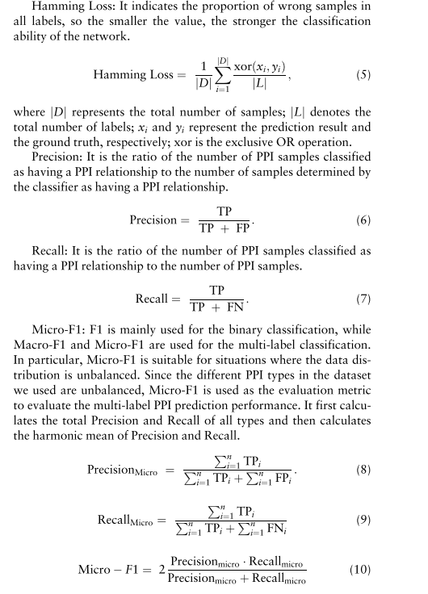

## 补充

**Siamese network**就是“连体的神经网络”，神经网络的“连体”是通过共享权值来实现的，如下图所示。

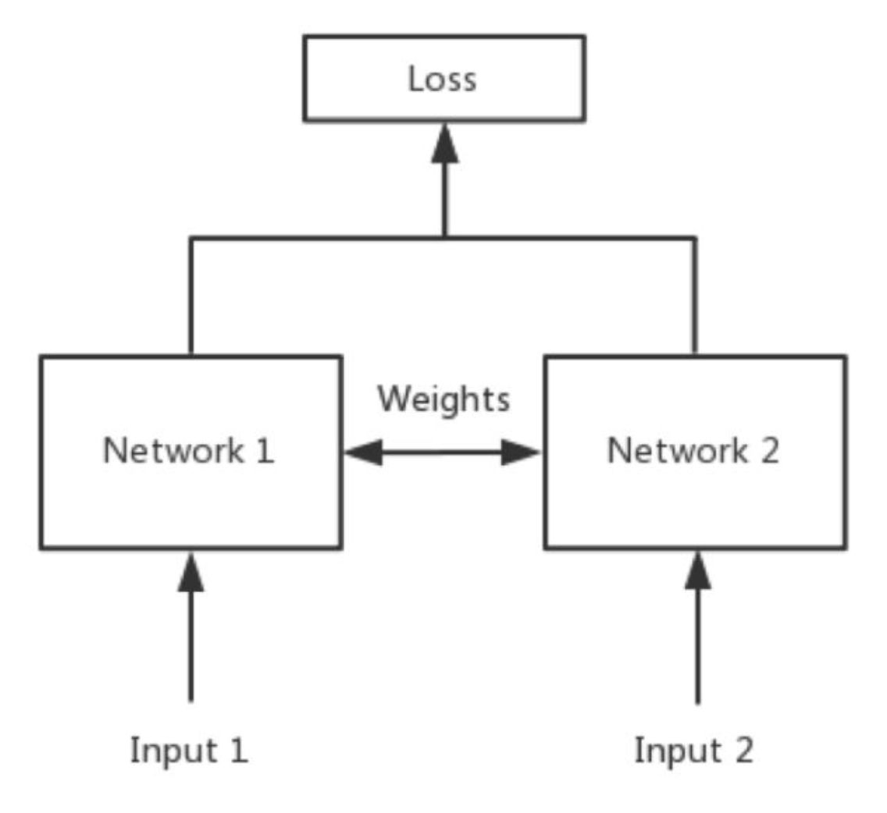

**深度残差循环卷积神经网络**https://zhuanlan.zhihu.com/p/22447440

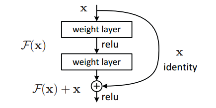

**掩码语言模型(Masked Language Model)mlm**

Transformer-model 相对RNN缺少了前后位置关系，所以需要添加位置关系

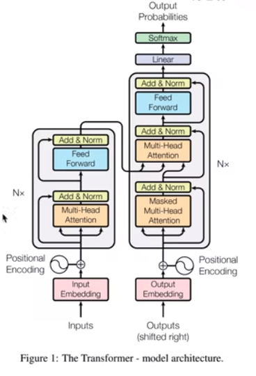

Transformer-model 相对RNN缺少了前后位置关系

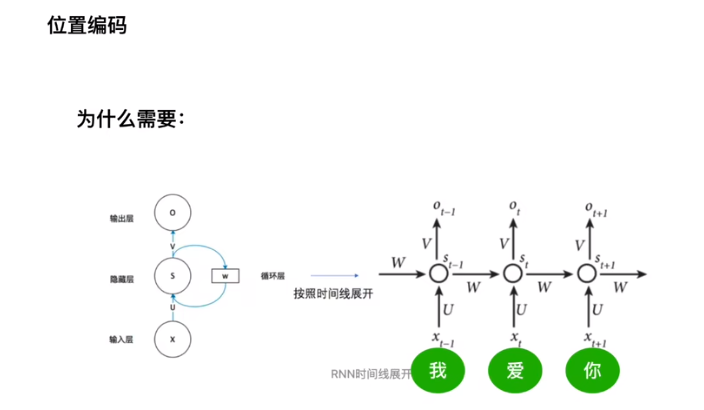

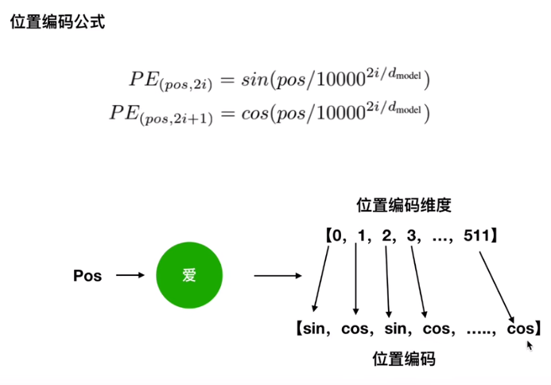

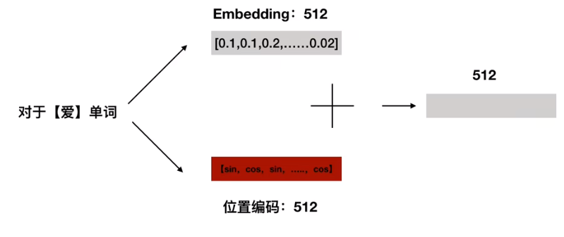

sin cos 体现得是绝对位置信息 但是又体现得相对位置信息

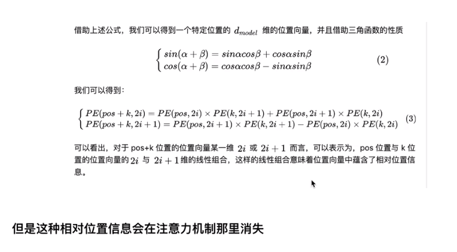

注意力机制-- QKV三个矩阵

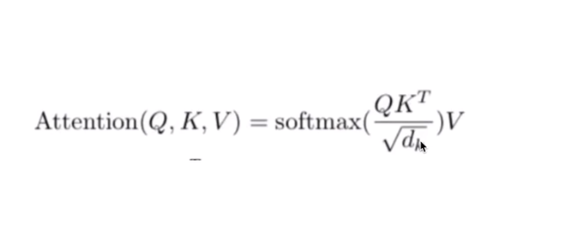

QUERY 与KEY之间并行点乘  --- 算内积  及cos相似性类似--得到向量之间相似性

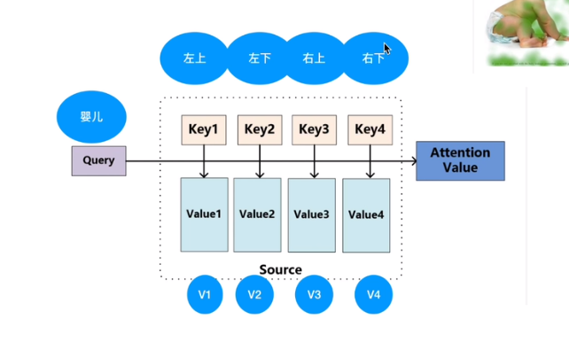

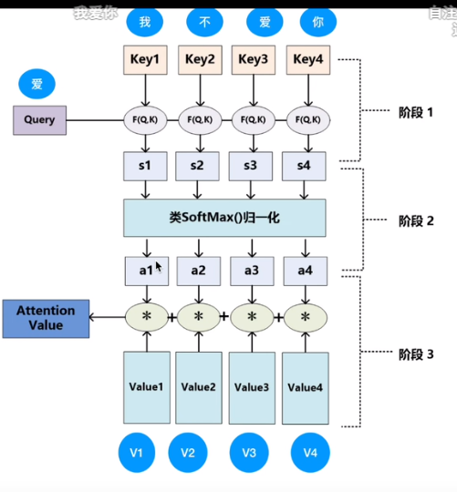

除以dk为softmax控制方差和梯度

多头注意力机制

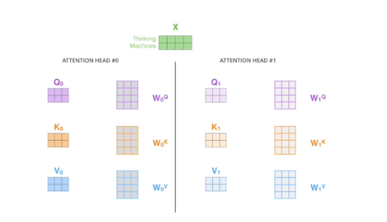

batch Normal 和 Layer Normalization

BN对不同样本进行标准化，优点能解决内部协变量偏移，缓解了梯度饱和问题，batchsize小比较差

会丢失掉掉同样本内前后得关系，在RNN中输入值或者对于输入特征为变化得时候那么是会变化得，同样位置可能不是同一纬度

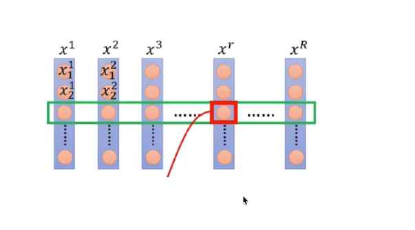

Layer 样本内做标准化对同一个样本内部纬度进行标准化。

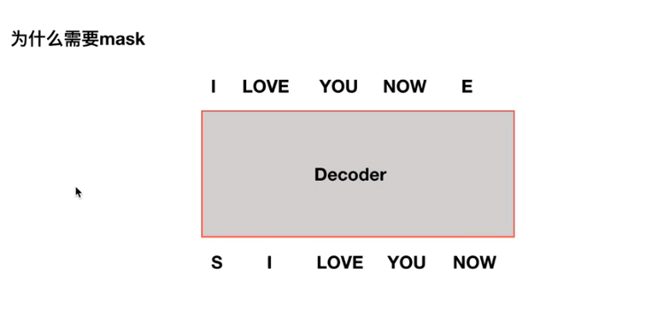

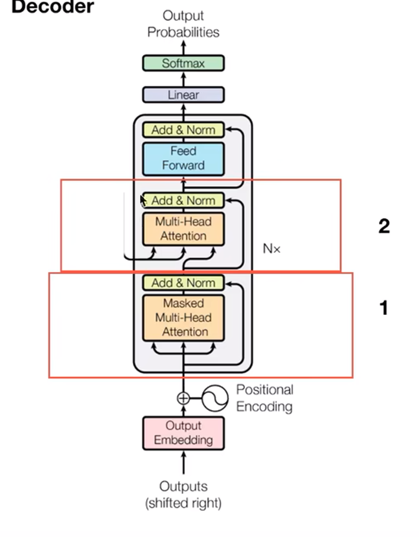

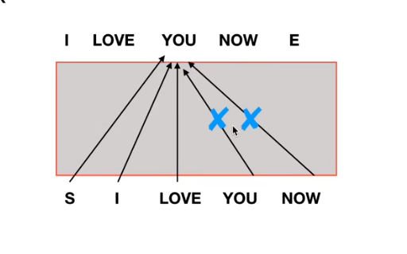

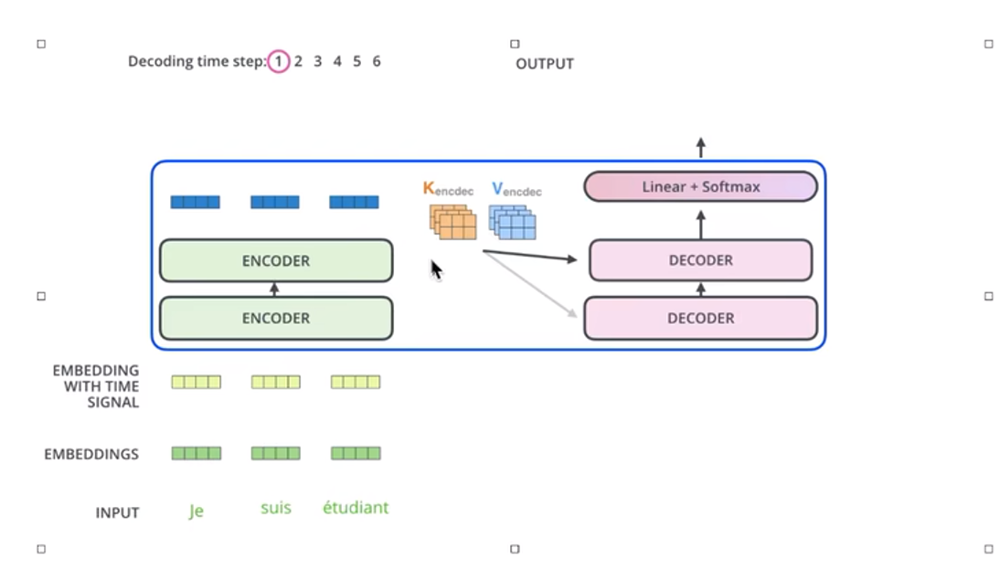

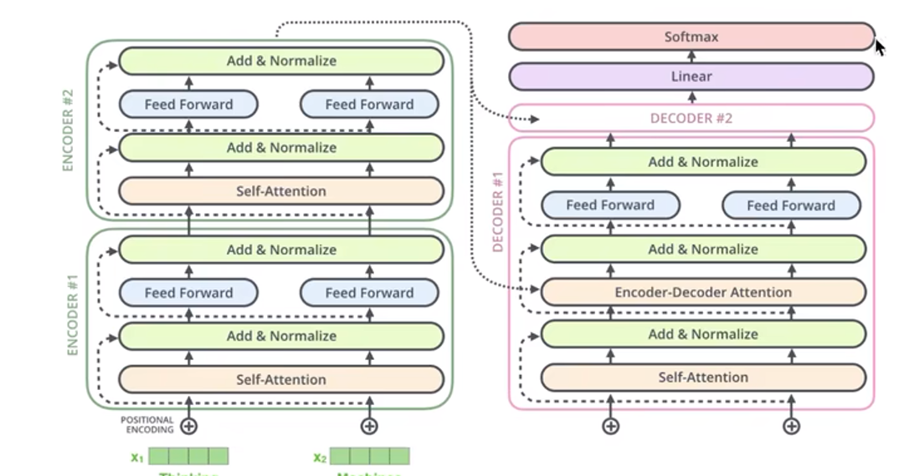

## 想法，
蛋白质序列为什么要截断呢，其实可以训练一个不截断的模型
无监督的基于蛋白质序列训练的模型应该可以从一个物种全部蛋白质直接预测相互作用，迁移或者直接预测其他物种的蛋白质相互作用。